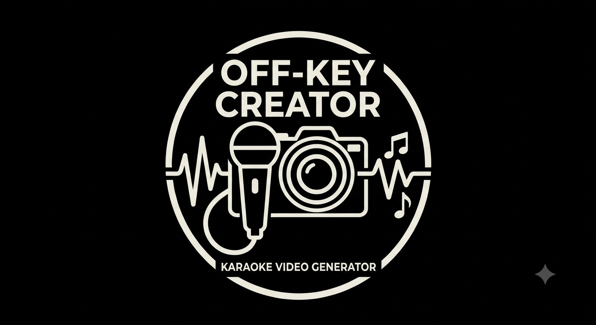

# Off-Key Creator

Self-hosted karaoke video creator. Upload a song, isolate the vocals with
Roformer AI models, transcribe the lyrics with whisperX forced alignment,
then render a karaoke `.mp4` with FFmpeg — all from a lightweight web UI.



## Stack

- **FastAPI** web server (UI, uploads, WebSocket progress)
- **Celery + Redis** async task queue for heavy AI / FFmpeg work
- **audio-separator** (Roformer models) for vocal isolation
- **whisperX** for word-level forced-aligned transcription
- **ffmpeg-python / FFmpeg** for layered video rendering
- **TailwindCSS + vanilla JS** frontend served by Jinja2

## Quick start

```bash
docker compose up --build
```

Then open <http://localhost:8000>.

Model weights (Roformer + Whisper) are downloaded on first use and cached
in `./data/models`, so subsequent runs are fast.

## Pipeline

1. **Upload** an MP3/WAV/FLAC/M4A — ID3 Artist/Title are pre-filled and editable.
2. **Separate** vocals with your choice of Roformer model; live chunk-level
   progress; preview both stems.
3. **Transcribe** the vocal stem (Whisper `large-v3` default) with live
   progress; a review checkpoint lets you fix misheard words without breaking
   timing, with optional reference lyrics fetched from LRCLIB shown
   side-by-side and a word-level **diff view** that highlights transcription
   mistakes at a glance. Prefix lines with `2:` to assign them to a second
   singer for duet mode.
4. **Configure** the video: resolution (480p–4K), background color/image,
   audio visualizer with opacity, karaoke text/highlight colors, lyric
   position (top/middle/bottom), intro title card, countdown dots before
   lines after instrumental gaps, next-line preview, **duet mode** (second
   highlight color via `2:` markers or auto-alternating), logo/watermark
   branding (6 positions, size + opacity), and an animated song progress bar
   (edge, color, thickness, opacity). Export/import layout presets as JSON
   for consistent album batches.
5. **Render** — live FFmpeg progress, then download
   `./data/output/Artist - Title.mp4`.

## Directory layout

```
data/
├── uploads/     # raw user audio
├── models/      # cached Hugging Face / Whisper / UVR weights
├── processed/   # per-job stems, lyrics.json, subtitles.ass
└── output/      # final rendered karaoke videos (Artist - Title.mp4)
```

## GPU acceleration (optional)

CPU is the default. To enable Nvidia CUDA:

1. Install the [NVIDIA Container Toolkit](https://docs.nvidia.com/datacenter/cloud-native/container-toolkit/latest/install-guide.html).
2. In the `Dockerfile`, swap the CPU torch line for the CUDA one (commented).
3. In `docker-compose.yml`, uncomment the `deploy:` block under `worker`
   and set `DEVICE=cuda`.
4. Rebuild: `docker compose build --no-cache && docker compose up`.

## Notes

- Separation model filenames map to the audio-separator / UVR model zoo.
  If a model name changes upstream, list available files with
  `docker compose run --rm worker audio-separator --list_models` and update
  `SEPARATION_MODELS` in `app/config.py`.
- Whisper `large-v3` on CPU is slow and memory-hungry; `small`/`medium`
  are good CPU defaults. Errors (e.g. OOM) are pushed live to the UI.
